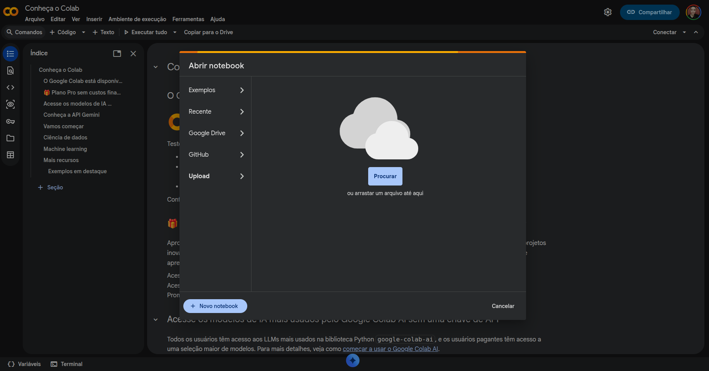

# Ferramentas
Ferramentas genéricas para analisar conjuntos de PDFs acadêmicos.
1) pdf_highlights_extractor.ipynb: Permite a extração de destaques e comentários em arquivos PDFs encontrados numa pasta do Google Drive. Esses arquivos podem estar aninhados, ou seja, em subpastas da pasta do Google Drive informada. 

# Como utilizar
Basta baixar o arquivo do código desejado, ir em [https://colab.research.google.com/](https://colab.research.google.com/) com sua conta Google, clicar em "Upload" e importar o arquivo .ipynb baixado.

Depois, leia as instruções de texto (caso existam) que aparecerão. Se houver necessidade de informar algum campo, faça-o antes de clicar no botão "Executar tudo". Preste atenção pois haverá um pop-up que se abrirá para solicitar que você permita o Jupyter Notebook a acessar os seus arquivos no Google Drive. Selecione os itens e dê a permissão para continuar.
